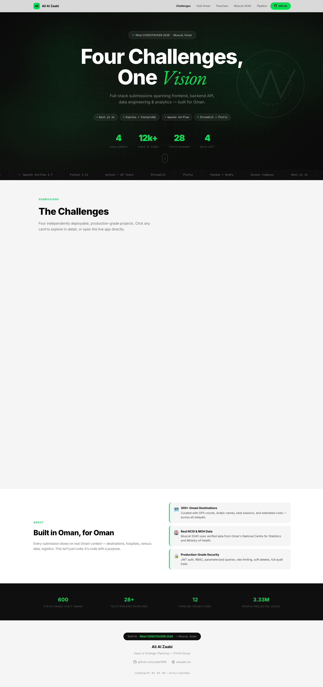
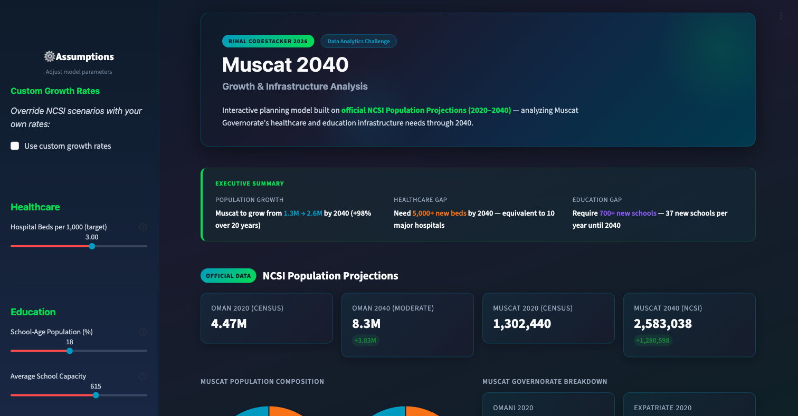

# Muscat 2040 — Growth & Infrastructure Analysis

> **[View All Submissions — alizaabi.om/rihal-codestack](https://alizaabi.om/rihal-codestack/)**



**Live Dashboard:** [alizaabi.om/rihal-codestack/muscat-2040](https://alizaabi.om/rihal-codestack/muscat-2040/)

---


---

I approached this challenge from the perspective of someone who lives in Muscat and has seen the city transform over the past two decades. I remember when Seeb was the outskirts — now it's a sprawling urban center with traffic that rivals Al Khuwair. Bawshar has gone from quiet residential to a commercial corridor. Al Amerat, which barely registered on the map in 2003, now has its own schools, hospitals, and rush hour.

The question isn't whether Muscat will grow. It's whether we'll build the hospitals and schools fast enough to keep up.

This project models Muscat Governorate's population through 2040 under three scenarios and quantifies the infrastructure gap in healthcare and education. The interactive dashboard lets planners adjust assumptions and immediately see the impact on demand.

---

## Screenshot



---

## Key Findings

- Muscat grows from **1.3M to 2.6M by 2040** — a **+98% increase**
- Need **5,000+ new hospital beds** — equivalent to **10 new 500-bed hospitals**
- Need **700+ new schools** — approximately **37 new schools per year**
- **Expatriate population drives the majority of growth**

| Metric | Base Case | High Growth | Low Growth |
|---|---|---|---|
| **2040 Population** | ~2.9M | ~3.7M | ~2.1M |
| **Hospital Beds Needed** | 8,765 | 11,181 | 6,301 |
| **Bed Shortfall** | 4,565 | 6,981 | 2,101 |
| **Schools Needed** | 1,052 | 1,342 | 757 |
| **School Shortfall** | 502 | 792 | 207 |

Even the most conservative scenario requires 4 new hospitals and 12 new schools per year.

---

## Features

- **Interactive Streamlit dashboard** — all charts are filterable and zoomable
- **3 growth scenarios** — Low / Moderate / High projections
- **Healthcare gap analysis** — bed-to-population ratio vs. WHO benchmarks
- **Education gap analysis** — school capacity vs. projected student population
- **Sensitivity analysis** — plug in custom growth rates and see instant results
- **Population composition** — Omani vs. Expatriate breakdown over time
- **CSV export** — download any data table for further analysis

---

## What You'll See

- **Population Projection Chart** — three scenarios plotted 2023–2040 with adjustable growth and migration sliders
- **Healthcare Analysis** — bed demand vs. current capacity, breakpoint year, gap quantification
- **Education Analysis** — school demand vs. current capacity, same format
- **Sensitivity Analysis** — how 2040 population shifts across growth rates from 1% to 6%

All charts are interactive (Plotly). Sidebar sliders update everything in real time.

---

## Quick Start

```bash
# Clone
git clone https://github.com/zaabi1995/rihal-muscat-2040.git
cd rihal-muscat-2040

# Setup
python3 -m venv .venv
source .venv/bin/activate
pip install -r requirements.txt

# Run
streamlit run app.py
```

Opens at `http://localhost:8501`.

---

## Methodology

**Population model:** Compound annual growth rate with separate natural growth and net migration components. Three scenarios bracket the range from economic slowdown (2% growth, no migration) to Vision 2040 boom (4.5% growth + 1% migration). The base case at 4.0% combined rate is deliberately conservative against the 2003–2023 historical CAGR of 4.4%.

**Infrastructure demand:** Simple ratio models — beds per 1,000 population (WHO benchmark), schools per school-age cohort (18% of total, 500 students per school). Not intended to replace detailed facility planning, but to show the scale of the challenge.

Full details in the [Technical Appendix](docs/technical_appendix.md).

---

## Data Sources

- **NCSI** — Population Projections (2020–2040), Census 2003/2010/2020, Statistical Yearbook ([data.gov.om](https://data.gov.om))
- **Ministry of Health (MOH)** — Hospital bed capacity, Muscat (Annual Report 2023)
- **Ministry of Education (MOE)** — School count and capacity (Statistical Yearbook 2023)
- **WHO** — Global Health Observatory bed benchmarks
- **UNESCO** — Institute for Statistics class size data

---

## Tech Stack

| Layer | Technology |
|---|---|
| Language | Python 3.10+ |
| Dashboard | Streamlit |
| Charts | Plotly |
| Data processing | Pandas, NumPy |

---

## Project Structure

```
muscat-2040/
├── app.py                      # Streamlit dashboard
├── analysis/
│   ├── population_model.py     # CAGR with 3 scenarios
│   ├── healthcare_analysis.py  # Bed demand model
│   └── education_analysis.py   # School demand model
├── data/                       # Baseline CSVs
├── docs/
│   ├── executive_summary.md    # 2-page brief for decision makers
│   └── technical_appendix.md   # Full methodology
├── screenshots/
│   └── muscat-2040-dashboard.png
└── requirements.txt
```

---

## Author

**Ali Al Zaabi**
Submitted for Rihal CODESTACKER 2026 — Challenge #6: Data Analytics

---

## Other Challenges

- [Visit Oman](https://github.com/zaabi1995/rihal-visit-oman) — Challenge #1: Frontend Development
- [FlowCare API](https://github.com/zaabi1995/rihal-flowcare) — Challenge #2: Backend Development
- [DE Pipeline](https://github.com/zaabi1995/rihal-de-pipeline) — Challenge #4: Data Engineering
